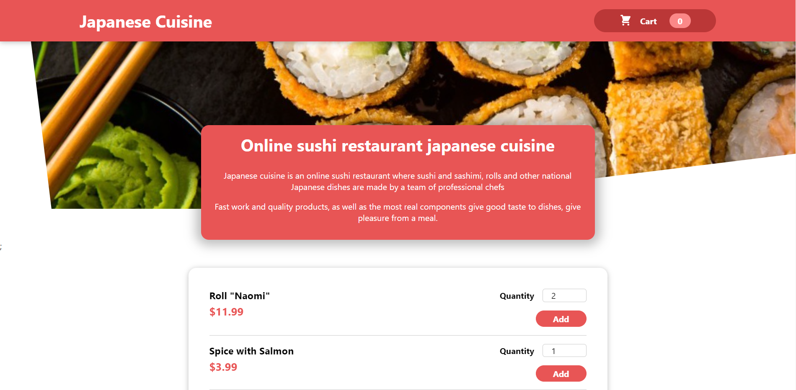
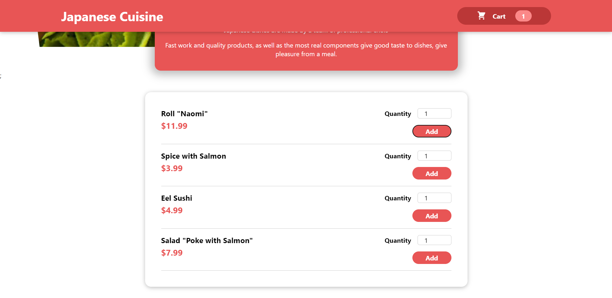
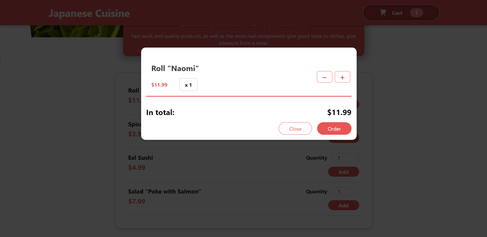

<h1 align="center">Japanese Cuisine Online Sushi Restaurant</h1>

**`This is a React-based web application for an online sushi restaurant that offers a variety of Japanese dishes. Customers can view the menu, select items, and add them to their cart for ordering. The application provides a user-friendly interface and allows users to adjust the quantity of items in their cart.`**  

<h1 align="center">Technologies</h1>

**`React: The frontend is built using the React JavaScript library.`**  
**`CSS Modules: CSS Modules are used for styling to keep styles scoped to individual components.`** 
**`React Portals: React Portals are used to create modal windows for the cart and menu items.`**

<h1 align="center">Key Features</h1>

**`Menu Display: The application displays a list of Japanese dishes, including names, descriptions, and prices.`**  
**`Cart Functionality: Users can add items to their cart and adjust the quantity of each item.`**  
**`Modal Window: A modal window is used to display the cart and menu items, providing a smooth user experience.`**  
**`Validation: Input validation ensures that the quantity of items in the cart is within a valid range.`**  
**`Styling: The application uses CSS modules for styling, providing a clean and visually appealing design.`**  

<h1 align="center">Screenshots</h1>
    
    
    
